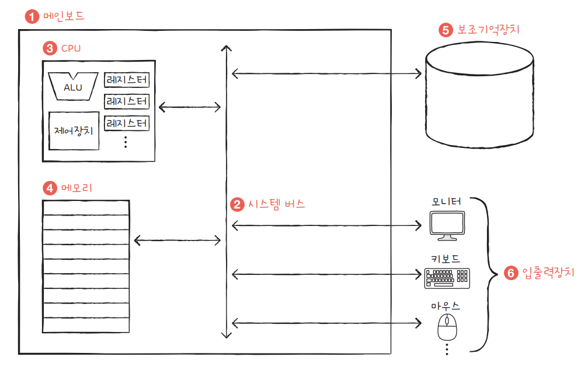

# 1. 컴퓨터 구조 시작하기

## 컴퓨터 구조의 큰 그림

### 컴퓨터가 이해하는 정보

- 데이터와 명령어가 있다.
- 데이터(data)

  - 컴퓨터가 이해하는 숫자, 문자 등 정적인 정보

- 명령어
  - 데이터를 움직이고 컴퓨터를 작동시키는 정보

 

### 컴퓨터의 4가지 핵심 부품

- 중앙처리장치(CPU), 주기억장치(메모리), 보조기억장치, 입출력장치

#### 메모리

- 현재 실행되는 프로그램의 명령어와 데이터를 저장하는 부품
- 프로그램이 실행되려면 반드시 메모리에 저장되어 있어야 한다.
- 메모리에 저장된 값의 위치는 `주소(address)` 로 알 수 있다.

#### CPU

- 메모리에 저장된 명령어를 읽어 들이고, 읽어 들인 명령어를 해석하고, 실행하는 부품
- 산술논리연산장치(ALU), 레지스터, 제어장치로 구성된다.
  - ALU : 계산 수행
  - 레지스터 : CPU 내부의 작은 임시 저장 장치
  - 제어장치 : 제어 신호라는 전기 신호를 내보내고 명령어를 해석

#### 보조기억장치

- 메모리는 가격이 비싸 용량이 적고, 전원이 꺼지면 내용을 잃는다.
- 보조기억장치는 전원이 꺼져도 보관될 프로그램을 저장하는 부품

#### 입출력장치

- 마이크, 스피커 등 컴퓨터 외부에 연결되어 컴퓨터 내부와 정보를 교환하는 장치

#### 시스템 버스

- 메인보드에 연결된 부품들이 서로 정보를 주고 받는 통로
- 구성
  - 주소 버스 : 주소를 주고받는 통로
  - 데이터 버스 : 명령어와 데이터를 주고받는 통로
  - 제어 버스 : 제어 신호를 주고받는 통로
