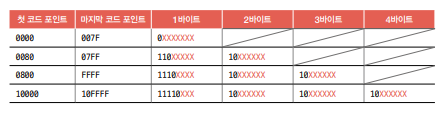

# 2. 데이터

## 2-1. 0과 1로 숫자를 표현하는 방법

### 정보 단위

비트(bit) : 0과 1을 나타내는 가장 작은 정보 단위

- n비트로 2^n가지 정보를 표현할 수 있다.

더 큰 단위

- 1바이트(byte) = 8비트
- 1킬로바이트(KB) = 1000바이트
- 1메가바이트(MB) = 1000킬로바이트
- 1기가바이트(GB) = 1000메가바이트
- 1테라바이트(TB) = 1000기가바이트

> 워드(word)
>
> - CPU가 한 번에 처리할 수 있는 데이터 크기
> - 한 번에 16비트를 처리할 수 있다 -> 1워드 = 16비트
> - 예) x64 CPU = 64비트 워드 CPU

 

### 이진법

- 이진수 끝에는 아래첨자 (2)를 붙이거나, 앞에 0b를 붙인다.

#### 음수 표현

- 2의 보수를 구해 이 값을 음수로 간주하는 방법

> 2의 보수(two's complement)
>
> - 어떤 수를 그보다 큰 2^n에서 뺀 값
> - ex) 0b11의 보수는 0b100에서 0b11을 뺀 0b01이 된다.

- 모든 0과 1을 뒤집고, 거기에 1을 더한 값

  > ex) 0b11의 모든 0과 1을 뒤집으면 0b00 -> 1을 더하면 0b01

- 한계
  - 2^n의 보수는 자기 자신이 되어버리는 문제가 있다.
  - 즉 n비트로는 -2^n과 2^n을 동시에 표현할 수 없다.

이때, 이진수만 봐서는 음수인지 양수인지 구분하기 어려워 플래그를 사용한다.

 

### 십육진법

- 이진법으로 모든 숫자를 표현하다보니 숫자의 길이가 너무 길어져 십육진법을 사용한다.

- 십진수 10, 11, 12, 13, 14, 15는 각각 A, B, C, D, E, F로 표기한다.

- 표기할 때는 아래첨자 (16)을 붙이거나 숫자 앞에 0x를 붙인다.

- 이진수 <-> 십육진수는 서로 변환하기 쉽다.

#### 십육진수 -> 이진수

십육진수를 이루는 숫자 하나를 이진수로 표현하기 위해서는 4비트가 필요하다.

즉, 십육진수 한 글자를 4비트의 이진수로 변환하여 이어붙이면 변환된다 !

예) 십육진수 1A2B

- 1 = 이진수 0001
- A = 이진수 1010
- 2 = 이진수 0010
- B = 이진수 1011

따라서 십육진수 1A2B = 이진수 0001101000101011 이다.

#### 이진수 -> 십육진수

이진수 숫자를 네 개씩 끊고, 끊어 준 네 개의 숫자를 하나의 십육진수로 변환한 뒤 이어붙인다.

예) 이진수 11010101

- 1101 = 십육진수 D
- 0101 = 십육진수 5

따라서 이진수 11010101 = 십육진수 D5 이다.

 

## 2-2. 0과 1로 문자를 표현하는 방법

### 문자 집합과 인코딩

- 문자 집합(character set)
  - 컴퓨터가 인식하고 표현할 수 있는 문자의 모음
- 문자 인코딩
  - 컴퓨터가 문자를 이해할 수 있도록 0과 1로 변환
  - 결과값 = 문자 코드
  - 같은 문자 집합에 대해 다양한 인코딩 방법이 있을 수 있다.
- 문자 디코딩
  - 0과 1로 이루어진 문자 코드를 사람이 이해할 수 있는 문자로 변환

 

### 아스키코드

초창기 문자 집합 중 하나

- 영어 알파벳, 아라비아 숫자, 일부 특수 문자를 포함한다.
- 아스키 문자는 각각 7비트로 표현된다.
- 2^7 = 128개의 문자를 표현할 수 있다.
  > 실제로는 하나의 아스키 문자를 나타내기 위해 8비트를 사용한다. 이때 1비트는 패리티 비트(parity bit)라 불리는, 오류 검출을 위해 사용되는 비트이다.
- 아스키 문자에 대응된 고유한 수(= 코드 포인트)를 아스키 코드라 한다.

- 매우 간단히 인코딩 되지만, 한글 등 다양한 문자를 표현할 수 없다.
- 이후 1비트를 추가한 8비트 확장 아스키가 등장하기도 했다.

### EUC-KR

한글 인코딩에는 두 가지 방식이 있다.

- 완성형 인코딩 : 완성된 하나의 글자에 고유한 코드 부여
- 조합형 인코딩 : 초성, 중성, 종성을 위한 비트열을 할당해 그것들의 조합으로 하나의 글자 코드를 완성

EUC-KR은 완성형 인코딩 방식으로, 하나의 단어에 2바이트 크기의 코드를 부여한다.

- 2바이트 코드 = 16비트 = 4자리 십육진수로 표현된다.

문자 집합에 정의되지 않은 글자는 표현할 수 없다.

이를 해결하기 위해 마이크로소프트의 CP949가 등장했으나, 한글 전체를 표현할 수는 없었다.

 

### 유니코드와 UTF-8

유니코드는 대부분 나라의 문자, 특수문자, 이모티콘 까지 코드로 표현할 수 있는 통일된 문자집합이다.

- 글자에 부여된 값 자체를 인코딩된 값으로 삼지 않고, 이 값을 다양한 방법으로 인코딩
  - 인코딩 방법에는 UTF-8, UTF-16, UTF-32 등이 있다.

#### UTF-8

1바이트 ~ 4바이트까지의 인코딩 결과를 만들어낸다.

인코딩 결과는 유니코드 문자에 부여된 값의 범위에 따라 결정된다.

예) 한 = 0xD55C, 글 = 0xAE00

- 두 글자 모두 0x0800 ~ 0xFFFF 사이에 있음 = 3바이트로 표현
- 위 표에서 붉은색 X표가 있는 곳에 유니코드 문자에 부여된 고유한 값이 들어감
- 한 = 0b1101010101011100, 글 = 0b1010111000000000
- 따라서 인코딩 결과는
  - 한 = 11101101 10010101 10011100
  - 글 = 11101010 10111000 10000000
