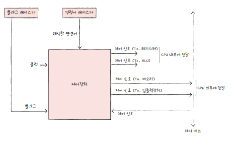
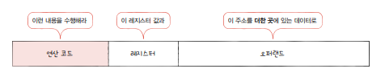
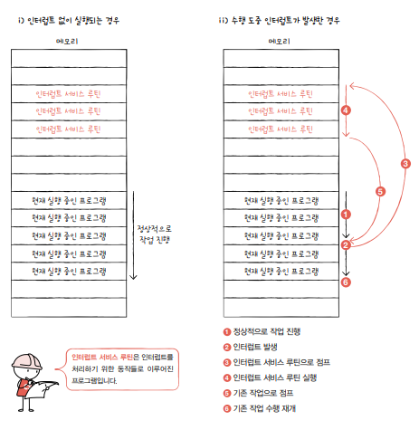

# 4. CPU의 작동 원리

## 4-1. ALU와 제어장치

### ALU

ALU가 받아들이는 정보

- 피연산자(레지스터)
- 제어 신호(제어장치)

ALU가 내보내는 정보

- 연산을 수행한 결과는 바로 메모리에 저장되지 않고 일시적으로 레지스터에 저장된다.(메모리 접근은 느리기 때문)
- 플래그 : 연산 결과에 대한 추가적인 정보를 내보내야 할 때 사용한다.

#### 플래그

- 부호 플래그

  - 연산한 결과의 부호를 나타낸다.
  - 예시: 부호 플래그가 1이면 음수, 0이면 양수

- 제로 플래그

  - 연산 결과가 0인지 여부
  - 예시 : 제로 플래그가 1이면 연산 결과가 0, 0이면 0이 아님

- 캐리 플래그

  - 연산 결과 올림수나 빌림수가 발생했는지
  - 예시 : 캐리 플래그가 1이면 올림수나 빌림수가 발생했음, 0이면 발생하지 않았음

- 오버플로우 플래그

  - 오버플로우가 발생했는지
  - 예시 : 오버플로우 플래그가 1이면 오버플로우 발생, 0이면 발생하지 않았음

- 인터럽트 플래그

  - 인터럽트가 가능한지
  - 예시 : 인터럽트 플래그가 1이면 인터럽트 가능, 0이면 불가능

- 슈퍼바이저 플래그
  - 커널 모드로 실행 중인지, 사용자 모드로 실행 중인지
  - 예시 : 슈퍼바이저 플래그가 1이면 커널 모드로 실행 중, 0이면 사용자 모드

플래그는 플래그 레지스터에 저장된다.

 

### 제어 장치

제어 신호를 내보내고, 명령어를 해석하는 부품

#### 제어장치가 받아들이는 정보

제어장치는 클럭 신호를 받아들인다.

- 클럭

  - 컴퓨터의 모든 부품을 움직이는 시간 단위
  - 주기에 맞춰 데이터가 이동되거나 ALU 연산이 수행되거나, 메모리에 저장된 명령어를 읽는 등

  - 하나의 명령어가 여러 클럭에 걸쳐 실행될 수도 있다.

제어장치는 명령어 레지스터로부터 해석할 명령어를 받아들이고 해석한다.

제어장치는 플래그 레지스터 속 플래그 값을 받아들이고 참고한다.

제어장치는 시스템 버스, 그중 제어 버스로 전달된 제어 신호를 받아들인다.

#### 제어장치가 내보내는 정보

제어 버스로 메모리나 입출력장치에 제어 신호를 전달한다.

- 메모리에 저장된 값을 읽거나 메모리에 새로운 값을 쓸 때

- 입출력장치의 값을 읽거나 입출력 장치에 새로운 값을 쓰고 싶을 때

CPU 내부로는 ALU와 레지스터에 전달하는 제어 신호가 있다.

- ALU : 수행할 연산을 지시하기 위해

- 레지스터 : 레지스터 간 데이터를 이동시키거나 레지스터에 저장된 명령어를 해석하기 위해

 

## 4-2. 레지스터

### 반드시 알아야 할 레지스터

#### 프로그램 카운터

- 메모리에서 가져올 명령어의 주소 저장
- 명령어 포인터 라고도 한다.

#### 명령어 레지스터

- 방금 메모리에서 읽어 들인 명령어를 저장하는 레지스터
- 제어장치는 명령어 레지스터 속 명령어를 받아들이고 해석한다.

#### 메모리 주소 레지스터

- 메모리 주소 저장
- CPU가 읽어 들이고자 하는 주소 값을 주소 버스로 보낼 때 메모리 주소 레지스터를 거친다.

### 메모리 버퍼 레지스터

- 메모리와 주고받을 값(명령어, 데이터)을 저장하는 레지스터
- 메모리에 쓰고 싶은 값이나 메모리로부터 전달받은 값은 메모리 버퍼 레지스터를 거친다.
- 메모리 데이터 레지스터라고도 부른다.

#### 범용 레지스터

- 다양하고 일반적인 상황에서 자유롭게 사용할 수 있는 레지스터
- 데이터와 주소를 모두 저장할 수 있다.
- CPU 안에는 여러 개의 범용 레지스터가 있다.

#### 플래그 레지스터

- ALU 연산 결과에 따른 플래그를 저장

 

### 특정 레지스터를 이용한 주소 지정 방식

- 스택 포인터

  - 스택 주소 지정 방식에서 사용된다

- 프로그램 카운터, 베이스 레지스터
  - 변위 주소 지정 방식에서 사용된다.

#### 스택 주소 지정 방식

- 스택과 스택 포인터를 이용한 주소 지정 방식
- 스택 포인터
  - 스택의 꼭대기를 가리키는 레지스터
  - 스택의 어디까지 데이터가 채워져 있는지에 대한 표시
- 스택 영역
  - 메모리 안에 스택처럼 사용할 영역이 정해져 있음

#### 변위 주소 지정 방식

오퍼랜드 필드의 값(변위)과 특정 레지스터의 값을 더해 유효 주소를 얻어내는 방식

변위 주소 지정 방식을 사용하는 명령어는 연산 코드 필드 + 레지스터 필드 + 오퍼랜드 필드가 있다.

오퍼랜드 필드 주소와 어떤 레지스터를 더하는지에 따라 상대 주소 지정 방식, 베이스 레지스터 주소 지정 방식 등으로 나뉜다.

- 상대 주소 지정 방식

  - 오퍼랜드 + 프로그램 카운터의 값
  - if문처럼 모든 코드를 실행하지 않고 특정 주소의 코드를 실행할 때 사용

- 베이스 레지스터 주소 지정 방식
  - 오퍼랜드 + 베이스 레지스터의 값
  - 베이스 레지스터 = 기준 주소
  - 오퍼랜드 = 기준 주소로부터 떨어진 거리
  - 예) 베이스 레지스터에 200, 오퍼랜드에 40 = 기준 주소 200번지로부터 40만큼 떨어진 240번지로 접근하라

 

## 4-3. 명령어 사이클과 인터럽트

CPU가 하나의 명령어를 처리하는 정형화된 흐름을 명령어 사이클이라고 한다.

이 흐름이 끊어지는 상황을 인터럽트라고 한다.

### 명령어 사이클

명령어들은 일정한 주기가 반복되며 실행되는데, 이 주기를 명령어 사이클이라 한다.

- 명령어를 메모리에서 CPU로 가져오기(인출 사이클)
- CPU로 가져온 명령어를 실행하는 단계(실행 사이클)
- 간접 주소 지정 방식 - 명령어를 인출하여 CPU로 가져와도 명령어 실행을 위해서 한 번 더 접근해야 함(간접 사이클)

 

### 인터럽트

CPU가 수행 중인 작업을 방해하는 신호

#### 종류

- 동기 인터럽트

  - CPU에 의해 발생하는 인터럽트
  - 예외(exception) 라고도 부른다.
  - 예) CPU가 실행하는 프로그래밍상의 오류 등 예외적 상황에 마주쳤을 때 발생

- 비동기 인터럽트
  - 주로 입출력장치에 의해 발생하는 인터럽트
  - 하드웨어 인터럽트라고도 한다. 일반적으로 비동기 인터럽트를 인터럽트라 칭한다.
  - 예)
    - 프린터 등이 작업을 끝내고 완료 알림을 보낸다.
    - 키보드, 마우스 등이 입력을 받았을 때 처리하기 위해 입력 알림을 보낸다.

#### 하드웨어 인터럽트

CPU는 입출력 작업 도중에 효율적으로 명령어를 처리하기 위해 하드웨어 인터럽트를 사용한다.

- 하드웨어 인터럽트를 사용하면 주기적으로 완료 여부를 확인할 필요가 없다.
- 작업이 완료될 때까지 다른 작업을 처리할 수 있다.

#### 하드웨어 인터럽트 처리 순서

- 입출력장치가 CPU에 인터럽트 요청 신호를 보낸다.

- CPU는 실행 사이클이 끝나고 명령어를 인출하기 전 항상 인터럽트 여부를 확인한다.
- CPU는 인터럽트 요청을 확인하고 `인터럽트 플래그`를 통해 현재 인터럽트를 받아들일 수 있는지 여부를 확인한다.
  - 플래그 레지스터의 `인터럽트 플래그` : 하드웨어 인터럽트를 받아들일지. 무시할지 결정하는 플래그
  - 불가능이면 인터럽트 요청 무시
  - 가능이면 인터럽트 처리
  - 막을 수 없는 인터럽트도 있다 : 정전, 하드웨어 고장 등
- 인터럽트를 받아들일 수 있다면 CPU는 지금까지의 작업을 `백업`한다.

  - 인터럽트 서비스 루틴을 실행하기 전에 프로그램 카운터 값 등 현재 프로그램 재개에 필요한 모든 내용을 스택에 백업한다.

- CPU는 `인터럽트 벡터`를 참조하여 `인터럽트 서비스 루틴`을 실행한다.
  - 인터럽트 서비스 루틴
    - 인터럽트를 처리하기 위한 프로그램
    - 인터럽트 핸들러라고도 한다.
  - 인터럽트 벡터
    - 인터럽트 서비스 루틴을 식별하기 위한 정보
    - 인터럽트 서비스 루틴의 시작 주소를 알 수 있다.
    - 하드웨어 인터럽트 요청을 보낸 대상으로부터 데이터 버스를 통해 인터럽트 벡터를 전달받는다.
- 인터럽트 서비스 루틴 실행이 끝나면 백업해 둔 작업을 복구하여 실행한다.

 

### 예외의 종류

예외 처리 후 본래 하던 작업으로 돌아와 실행할 때를 기준으로 나뉜다.

- 폴트(fault)

  - 예외를 처리한 직후 예외가 발생한 명령어부터 실행 재개
  - 예) 명령어 실행을 위해 필요한 데이터가 보조기억장치에 있다. -> 폴트 발생시키고 필요한 데이터를 메모리로 가져와 저장

- 트랩(trap)

  - 예외 처리한 직후 예외가 발생한 명령어의 다음 명령어부터 실행 재개
  - 예) 디버깅 끝나면 다음 명령어부터 실행

- 중단

  - CPU가 실행 중인 프로그램을 강제로 중단시킬 수밖에 없는 심각한 오류를 발견했을 때

- 소프트웨어 인터럽트
  - 시스템 호출이 발생했을 때
