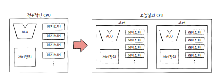
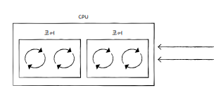
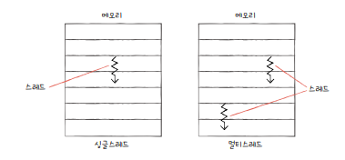
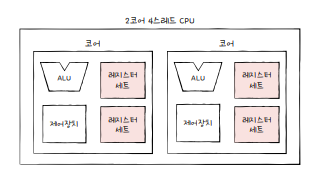
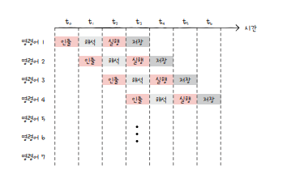
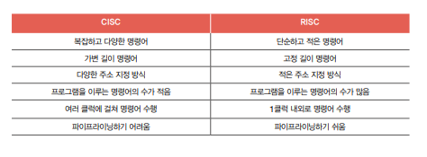

# 5. CPU 성능 향상 기법

## 5-1. 빠른 CPU를 위한 설계 기법

### 클럭

- 클럭 속도는 헤르츠(Hz) 단위로 측정한다.
- 1초에 100번 반복되면 = 100Hz
- 계속 일정한 클럭 속도를 유지하지 않고, 고성능이 필요한 순간에 클럭 속도를 높인다. 최대 클럭 속도를 강제로 더 끌어올리는 것을 `오버클럭킹`이라 한다.
- 클럭 속도가 너무 높아지면 발열 문제가 발생한다.

 

### 코어와 멀티코어

오늘날의 CPU는 '명령어를 실행하는 부품을 여러 개 포함하는 부품'을 의미한다.

- 8코어 = '명령어를 실행하는 부품'을 8개 포함한다.

 

이렇게 코어를 여러 개 포함하고 있는 CPU를 `멀티코어 CPU` 또는 `멀티코어 프로세서`라고 부른다.

하지만 CPU의 연산 속도가 코어 수에 비례하여 증가하지는 않고, 코어 수가 지나치게 많아도 영향이 없다.

 

### 스레드와 멀티스레드

스레드

- CPU에서 사용되는 `하드웨어적 스레드`
- 프로그램에서 사용되는 `소프트웨어적 스레드`

#### 하드웨어적 스레드

하나의 코어가 동시에 처리하는 명령어 단위  
하나의 코어로도 여러 개의 명령어를 동시에 실행할 수 있다.

하나의 코어로 여러 명령어를 동시에 처리하는 CPU를 `멀티스레드 프로세서` 또는 `멀티스레드 CPU`라고 한다.

- 하이퍼스레딩 : 인텔의 멀티스레드 기술

#### 소프트웨어적 스레드

하나의 프로그램에서 독립적으로 실행되는 단위  
하나의 프로그램이 실행되는 과정에서 프로그램의 여러 부분이 동시에 실행될 수도 있다.

#### 멀티스레드 프로세서

하나의 코어로 여러 명령어를 동시에 처리하려면 하나의 명령어를 처리하기 위해 꼭 필요한 `레지스터`를 여러 개 가지고 있으면 된다.

 

2코어 4스레드는 한 번에 네 개의 명령어를 처리할 수 있다. 
= 프로그램 입장에서는 한 번에 하나의 명령어를 처리하는 CPU가 네 개 있는 것처럼 보인다. 
= 하드웨어 스레드를 `논리 프로세서`라고 부르기도 한다.

 

## 5-2. 명령어 병렬 처리 기법

### 명령어 파이프라인

명령어 처리 과정

- 명령어 인출(Instruction Fetch)
- 명령어 해석(Instruction Decode)
- 명령어 실행(Execute Instruction)
- 결과 저장(Write Back)

같은 단계가 겹치지 않는다면 CPU는 각 단계를 동시에 실행할 수 있다.

 

이처럼 명령어를 `명령어 파이프라인`에 넣고 동시에 처리하는 기법을 `명령어 파이프라이닝`이라고 한다.

 

파이프라인의 위험에는 크게 `데이터 위험`, `제어 위험`, `구조적 위험`이 있다.

#### 데이터 위험

명령어 간 `데이터 의존성`에 의해 발생한다.

- 명령어 1 : R2 + R3 값을 R1에 저장
- 명령어 2 : R1 + R5 값을 R4에 저장

이 때, 명령어 1을 수행해야만 명령어 2를 수행할 수 있다.
따라서 명령어 2는 명령어 1의 데이터에 의존적이다.

이 두 명령어를 무작정 동시에 실행하려고 하면 파이프라인이 제대로 동작하지 않는다.

#### 제어 위험

분기 등으로 인한 `프로그램 카운터의 갑작스러운 변화`에 의해 발생한다.

프로그램 실행 흐름이 바뀌어 프로그램 카운터 값에 변화가 생기면 미리 가지고와서 처리중이던 명령어는 쓸모가 없어진다.

이를 위해 프로그램이 어디로 분기할지 미리 예측한 후 주소를 인출하는 `분기 예측` 기술을 사용한다.

#### 구조적 위험

서로 다른 명령어가 동시에 ALU, 레지스터 등과 같은 CPU 부품을 사용하려고 할 때 발생한다.

`자원 위험`이라고도 부른다.

 

### 슈퍼스칼라

CPU 내부에 여러 개의 명령어 파이프라인을 포함한 구조를 `슈퍼스칼라`라고 한다.

슈퍼스칼라 구조로 명령어 처리가 가능한 CPU를 `슈퍼스칼라 프로세서` 또는 `슈퍼스칼라 CPU`라고 한다.

파이프라인이 여러 개이기 때문에 파이프라인 위험을 방지하기 위해 고도로 설계되어야 한다.

 

### 비순차적 명령어 처리(OoOE)

순서를 바꿔 실행해도 무방한 명령어를 먼저 실행해 명령어 파이프라인이 멈추는 것을 방지하는 기법

비순차적 명령어 처리가 가능한 CPU는 명령어들이 어떤 명령어와 데이터 의존성을 가지고 있는지 판단할 수 있어야 한다.

 

## 5-3. CISC와 RISC

### 명령어 집합

CPU마다 명령어의 세세한 생김새, 할 수 있는 연산, 주소 지정 방식 등이 차이가 있다.

CPU가 이해할 수 있는 명령어들의 모음을 `명령어 집합` 또는 `명령어 집합 구조(ISA)`라고 한다.

같은 소스 코드로 만들어진 같은 프로그램이어도 ISA가 다르면 어셈블리어도 달라진다.

ISA가 달라지면 제어장치가 명령어를 해석하는 방식, 사용되는 레지스터의 종류와 개수, 메모리 관리 방법 등이 달라진다.

 

### CISC(Complex Instruction Set Computer)

복잡하고 다양한 명령어들을 활용하는 CPU 설계 방식
x86, x86-64가 대표적이다.

다양하고 강력한 기능의 명령어 집합을 활용하기 때문에 명령어의 형태와 크기가 다양한 `가변 길이 명령어`를 활용한다.

= 상대적으로 `적은 수의 명령어`로도 프로그램을 실행할 수 있다.

= 컴파일된 프로그램의 크기가 `작다`.

 

하지만 활용하는 명령어가 복잡하고 다양한 기능을 제공하기 때문에 `명령어의 크기와 실행되기까지의 시간이 일정하지 않다`.

= 복잡한 명령어 때문에 명령어 하나를 실행하는 데에 `여러 클럭 주기가 필요`하다.

= 파이프라이닝이 `어렵다`.

++ 실제로는 자주 사용되는 명령어만 사용된다.

 

### RISC(Reduced Instruction Set Computer)

- 원활한 파이프라이닝을 위해 명령어 길이와 수행시간이 짧고 규격화되어야 한다.
- 자주 쓰이는 기본적인 명령어를 작고 빠르게 만든다.

이 두가지 원칙 하에 RISC가 등장했다.

CISC에 비해 명령어 종류가 적고, 짧고 규격화된 명령어(되도록 1클럭 내외로 실행) 지향

즉, `고정 길이 명령어`를 활용한다.

메모리에 직접 접근하는 명령어를 load, store 두 개로 제한할 만큼 메모리 접근을 단순화하고 최소화를 추구하기 때문에, CISC보다 `주소 지정 방식의 종류가 적다`.

대신 레지스터를 적극적으로 활용하고, 일반적인 경우보다 범용 레지스터 개수도 더 많다.

 

RISC는 CISC보다 많은 명령어로 프로그램을 작동시킨다.

