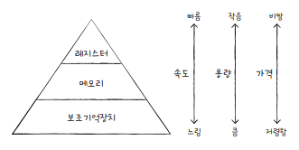
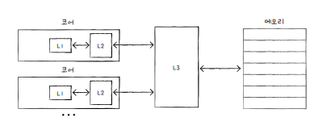
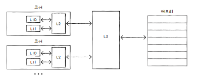

# 6. 메모리와 캐시 메모리

## 6-1. RAM의 특징과 종류

### RAM의 특징

- 휘발성 저장 장치
  - 전원을 끄면 저장된 내용이 사라진다.
  - RAM
- 비휘발성 저장 장치
  - 전원이 꺼져도 저장된 내용이 유지된다.
  - 하드 디스크, SSD, CD-ROM, USB 메모리 등 보조기억장치

일반적으로 비휘발성 저장 장치에는 `보관할 대상`을 저장하고, 휘발성 저장 장치인 RAM에는 `실행할 대상`을 저장한다.

 

### RAM의 용량과 성능

RAM의 용량이 적다면 보조 기억 장치에서 실행할 프로그램을 가져오는 일이 잦아 실행 시간이 길어진다.

즉, RAM의 용량이 크면 많은 프로그램들을 동시에 실행하는 데에 유리하다.

### RAM의 종류

크게 DRAM, SRAM, SDRAM, DDRSDRAM이 있다.

#### DRAM(Dynamic RAM)

- 시간이 지나면 저장된 데이터가 점차 사라지는 RAM
- 따라서 일정 주기로 데이터를 재활성화해야 한다.
- 소비 전력이 비교적 낮고, 저렴하고, 집적도가 높아 대용량으로 설계하기가 용이하다. -> 일반적으로 많이 사용한다.

#### SRAM(Static RAM)

- 저장된 데이터가 변하지 않는 RAM
- 시간이 지나도 저장된 데이터가 사라지지 않는다.
- DRAM보다 일반적으로 속도가 더 빠르다.
- 집적도가 낮고, 소비전력이 크고, 가격이 비싸 `캐시 메모리`로 많이 쓰인다.
  - 대용량으로 만들 필요는 없지만 속도가 빨라야하는 저장장치에 어울리기 때문

#### SDRAM(Synchronous Dynamic RAM)

- 클럭 신호와 동기화된, 발전된 형태의 DRAM
- 즉, 클럭 타이밍에 맞춰 CPU와 정보를 주고받을 수 있다.

#### DDR SDRAM(Double Data Rate SDRAM)

- 최근 가장 흔히 사용되는 RAM
- 대역폭을 넓혀 속도를 빠르게 만든 SDRAM
- 두 배의 대역폭 = 한 클럭 당 두 번씩 CPU와 데이터를 주고받을 수 있다.
- 한 클럭 당 하나씩 주고받는 SDRAM = SDR SDRAM

최근에는 대역폭이 16배 넓은 DDR4 SDRAM을 흔히 사용한다.

 

## 6-2. 메모리의 주소 공간

주소에는 `물리 주소` (메모리 하드웨어가 사용하는 주소)와 `논리 주소` (CPU와 실행 중인 프로그램이 사용하는 주소)가 있다.

 

### 물리 주소와 논리 주소

- 물리 주소
  - 메모리가 사용하는 주소
  - 정보가 실제로 저장된 하드웨어상의 주소
- 논리 주소
  - CPU와 실행 중인 프로그램이 사용하는 주소
  - 실행 중인 프로그램 각각에게 부여된 0번지부터 시작되는 주소

논리 주소와 물리 주소 간의 변환은 CPU와 주소 버스 사이에 위치한 `메모리 관리 장치(MMU)`라는 하드웨어에 의해 수행된다.

CPU가 발생시킨 논리 주소에 베이스 레지스터 값을 더해 논리 주소를 물리 주소로 변환한다.

- 논리주소 100번지, 베이스 레지스터 15000 = 물리주소 15100번지로 변환
- 물리 주소 15000번지부터 적재된 프로그램 A의 논리주소 100번지로 접근한다는 의미

즉, `베이스 레지스터`는 프로그램의 첫 물리 주소를 저장 / `논리 주소` 는 프로그램의 시작점으로부터 떨어진 거리

 

### 메모리 보호 기법

다른 프로그램의 영역을 침범할 수 있는 명령어는 위험하기 때문에 방지해야 한다.

이를 위해 `한계 레지스터`를 사용한다.

한계 레지스터는 논리 주소의 최대 크기를 저장한다.

즉, 프로그램의 물리 주소 범위는 베이스 레지스터 값 이상, 베이스 레지스터 값 + 한계 레지스터 값 미만

CPU가 접근하려는 논리 주소는 한계 레지스터가 저장한 값보다 커서는 안된다.

CPU가 한계 레지스터보다 높은 논리 주소에 접근하려고 하면 인터럽트(트랩)를 발생시켜 실행을 중단한다.

 

## 6-3. 캐시 메모리

### 저장 장치 계층 구조

컴퓨터가 사용하는 저장 장치들은 'CPU에 얼마나 가까운가'를 기준으로 계층적으로 나타낼 수 있다.
이를 `저장 장치 계층 구조`라 한다.

 

- 위로 올라갈수록 CPU와 가깝고 용량은 작지만 빠른 장치
- 가격도 위 계층으로 올라갈수록 비싸다.

 

### 캐시 메모리

CPU와 메모리 사이에 위치하고, 레지스터보다 용량이 크고 메모리보다 빠른 SRAM 기반의 저장 장치

`CPU의 연산 속도와 메모리 접근 속도의 차이를 조금이나마 줄이기 위해` 탄생했다.

코어와 가까운 순으로 L1캐시, L2 캐시, L3 캐시가 있다.

- 캐시 메모리 용량은 L1, L2, L3 순으로 커진다.
- 속도는 L3, L2, L1 순으로 빨라진다.
- 가격은 L3, L2, L1 순으로 비싸진다.

CPU가 메모리 내 데이터가 필요하다고 판단되면 L1 캐시에 있는지 알아보고, 없다면 L2, L3 캐시 순으로 데이터를 검색한다.

L1 캐시와 L2 캐시는 코어마다 고유한 캐시 메모리로 할당되고, L3 캐시는 여러 코어가 공유하는 형태로 사용된다.

#### 분리형 캐시

L1 캐시의 접근 속도를 조금이라도 빠르게 만들기 위해, 명령어만을 저장하는 L1캐시인 `L1I캐시`와 데이터만을 저장하는 L1 캐시인 `L1D`캐시로 분리하는 경우도 있다.

이를 `분리형 캐시`라고 한다.

 

### 참조 지역성 원리

캐시 메모리는 CPU가 사용할 법한 대상을 예측하여 저장한다.

이때 자주 사용될 것으로 예측한 데이터가 실제로 들어맞아 캐시 메모리 내 데이터가 CPU에서 활용될 경우를 `캐시 히트`라 한다.

반대로, 예측이 틀려 메모리에서 필요한 데이터를 직접 가져와야 하는 경우를 `캐시 미스`라 한다.

캐시가 히트되는 비율을 `캐시 적중률`이라 한다.

> 캐시 히트 횟수 / (캐시 히트 횟수 + 캐시 미트 횟수)

- 컴퓨터의 캐시 적중률은 대략 85~95% 이상이다.

캐시 메모리는 `참조 지역성의 원리`에 따라 메모리로부터 가져올 데이터를 결정한다.

참조 지역성의 원리란, CPU가 메모리에 접근할 때의 주된 경향을 바탕으로 만들어진 원리이다.

- CPU는 최근에 접근했던 메모리 공간에 다시 접근하려는 경향이 있다.
- CPU는 접근한 메모리 공간 근처를 접근하려는 경향이 있다.

 

#### 1. 최근에 접근했던 메모리 공간에 다시 접근하려는 경향

변수에 값을 저장하고 나면 언제든 변수에 다시 접근해 변수에 저장된 값을 사용할 수 있다.

= CPU는 변수가 저장된 메모리 공간을 언제든 다시 참조할 수 있다.

= 변수에 저장된 값은 일반적으로 여러 번 사용된다.

이렇게 최근에 접근했던 메모리 공간에 다시 접근하려는 경향을 `시간 지역성(temporal locality)`이라고 한다.

#### 2. 접근한 메모리 공간 근처를 접근하려는 경향

CPU가 실행하려는 프로그램은 보통 관련 데이터들끼리 한데 모여있다.

하나의 프로그램 내에서도 관련 있는 데이터들은 모여서 저장된다.

= CPU가 프로그램을 실행할 때는 프로그램이 모여있는 공간 근처를 집중적으로 접근한다.

= 사용자가 입력할 때는 관련 기능이 모여있는 공간 근처를 집중적으로 접근한다.

이렇게 접근한 메모리 공간 근처를 접근하려는 경향을 `공간 지역성(spatial locality)`이라 한다.

> 이렇게 캐시 메모리는 참조 지역성의 원리에 입각해 CPU가 사용할 법한 데이터를 예측한다.
