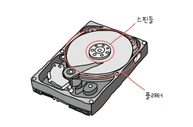
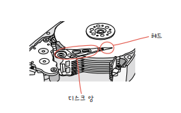
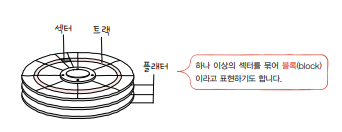
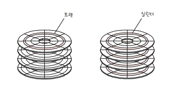
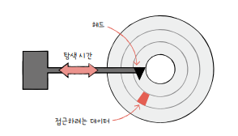
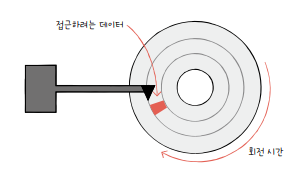
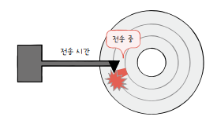
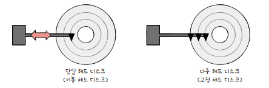

# 7. 보조기억장치

## 7-1. 다양한 보조기억장치

### 하드 디스크(HDD: Hard Disk Drive)

자기적인 방식으로 데이털르 저장하는 보조기억장치. 따라서 `자기 디스크(magnetic disk)`의 일종이라 지칭하기도 한다.

 

- 플래터(platter)

  - 하드 디스크에서 실질적으로 데이터가 저장되는 곳(동그란 원판)
  - 자기 물질로 덮여있어 수많은 N극과 S극을 저장한다.
  - N극과 S극은 0과 1의 역할을 수행한다.

- 스핀들(spindle)
  - 플래터를 회전시키는 구성 요소
  - 스핀들이 플래터를 돌리는 속도는 분당 회전수를 나타내는 RPM으로 표현한다.
  - ex. RPM이 15000 = 1분에 15000바퀴 회전

 

 

- 헤드(head)

  - 플래터를 대상으로 데이터를 읽고 쓰는 구성 요소
  - 플래터 위에서 미세하게 떠 있는 채로 데이터를 읽고 쓰는 바늘같이 생긴 부품

- 디스크 암(disk arm)
  - 헤드를 원하는 위치로 이동시킴

하드 디스크는 여러 겹의 플래터로 이루어져있으며, 플래터 양면을 모두 사용할 수 있다.

양면 플래터를 사용하면 위아래로 플래터당 두 개의 헤드가 사용된다.

#### 플래터에 데이터가 저장되는 방식

플래터는 `트랙(track)`과 `섹터(sector)`라는 단위로 데이터를 저장한다.

 

 

- 트랙

  - 플래터를 여러 동심원으로 나누었을 때 그 중 하나의 원

- 섹터
  - 피자처럼 여러 조각으로 나눴을 때 한 조각
  - 하드디스크의 가장 작은 전송 단위
  - 일반적으로 512바이트

 

 

- 실린더(cylinder)
  - 여러 겹의 플래터 상에서 `같은 트랙이 위치한 곳`을 모아 연결한 논리적 단위
  - 연속된 정보는 보통 한 실린더에 기록된다.
  - 디스크 암을 움직이지 않고 바로 데이터에 접근할 수 있기 때문이다.

#### 저장된 데이터에 접근하는 과정

하드 디스크가 저장된 데이터에 접근하는 시간은 크게 `탐색 시간`, `회전 지연`, `전송 시간`으로 나뉜다.

- 탐색 시간(seek time)
  - 접근하려는 데이터가 저장된 트랙까지 헤드를 이동시키는 시간

 

- 회전 지연(rotational latency)
  - 헤드가 있는 곳으로 플래터를 회전시키는 시간

 

- 전송 시간(transfer time)
  - 하드 디스크와 컴퓨터 간에 데이터를 전송하는 시간

#### etc

- 단일 헤드 디스크(single-head disk)

  - 플래터의 한 면당 헤드가 하나씩 달려있는 하드 디스크
  - 헤드를 데이터가 있는 곳까지 움직여야 하기 때문에 `이동 헤드 디스크(movable-head disk)`라 한다.

- 다중 헤드 디스크(multiple-head disk)
  - 헤드가 트랙별로 여러 개 달려있는 하드 디스크
  - 트랙마다 헤드가 있어 탐색 시간이 0
  - 따라서 헤드를 움직일 필요가 없어 `고정 헤드 디스크(fixed-head disk)`라 부른다.

