# 7. 보조기억장치

## 7-1. 다양한 보조기억장치

### 하드 디스크(HDD: Hard Disk Drive)

자기적인 방식으로 데이터를 저장하는 보조기억장치. 따라서 `자기 디스크(magnetic disk)`의 일종이라 지칭하기도 한다.

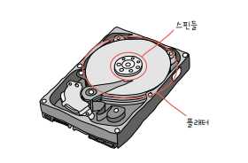

 

- 플래터(platter)

  - 하드 디스크에서 실질적으로 데이터가 저장되는 곳(동그란 원판)
  - 자기 물질로 덮여있어 수많은 N극과 S극을 저장한다.
  - N극과 S극은 0과 1의 역할을 수행한다.

- 스핀들(spindle)
  - 플래터를 회전시키는 구성 요소
  - 스핀들이 플래터를 돌리는 속도는 분당 회전수를 나타내는 RPM으로 표현한다.
  - ex. RPM이 15000 = 1분에 15000바퀴 회전

 

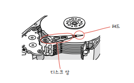

 

- 헤드(head)

  - 플래터를 대상으로 데이터를 읽고 쓰는 구성 요소
  - 플래터 위에서 미세하게 떠 있는 채로 데이터를 읽고 쓰는 바늘같이 생긴 부품

- 디스크 암(disk arm)
  - 헤드를 원하는 위치로 이동시킴

하드 디스크는 여러 겹의 플래터로 이루어져있으며, 플래터 양면을 모두 사용할 수 있다.

양면 플래터를 사용하면 위아래로 플래터당 두 개의 헤드가 사용된다.

#### 플래터에 데이터가 저장되는 방식

플래터는 `트랙(track)`과 `섹터(sector)`라는 단위로 데이터를 저장한다.

 

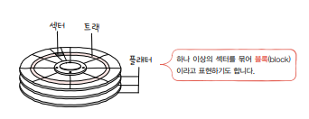

 

- 트랙

  - 플래터를 여러 동심원으로 나누었을 때 그 중 하나의 원

- 섹터
  - 피자처럼 여러 조각으로 나눴을 때 한 조각
  - 하드디스크의 가장 작은 전송 단위
  - 일반적으로 512바이트

 

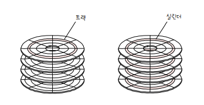

 

- 실린더(cylinder)
  - 여러 겹의 플래터 상에서 `같은 트랙이 위치한 곳`을 모아 연결한 논리적 단위
  - 연속된 정보는 보통 한 실린더에 기록된다.
  - 디스크 암을 움직이지 않고 바로 데이터에 접근할 수 있기 때문이다.

#### 저장된 데이터에 접근하는 과정

하드 디스크가 저장된 데이터에 접근하는 시간은 크게 `탐색 시간`, `회전 지연`, `전송 시간`으로 나뉜다.

- 탐색 시간(seek time)
  - 접근하려는 데이터가 저장된 트랙까지 헤드를 이동시키는 시간

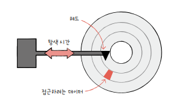

 

- 회전 지연(rotational latency)
  - 헤드가 있는 곳으로 플래터를 회전시키는 시간

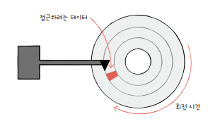

 

- 전송 시간(transfer time)
  - 하드 디스크와 컴퓨터 간에 데이터를 전송하는 시간

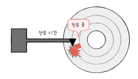

#### etc

- 단일 헤드 디스크(single-head disk)

  - 플래터의 한 면당 헤드가 하나씩 달려있는 하드 디스크
  - 헤드를 데이터가 있는 곳까지 움직여야 하기 때문에 `이동 헤드 디스크(movable-head disk)`라 한다.

- 다중 헤드 디스크(multiple-head disk)
  - 헤드가 트랙별로 여러 개 달려있는 하드 디스크
  - 트랙마다 헤드가 있어 탐색 시간이 0
  - 따라서 헤드를 움직일 필요가 없어 `고정 헤드 디스크(fixed-head disk)`라 부른다.

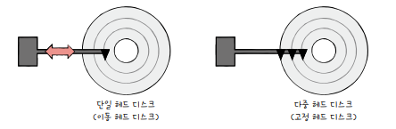

 

### 플래시 메모리(flash memory)

전기적으로 데이터를 읽고 쓸 수 있는 반도체 기반의 저장 장치

#### 종류

- NAND 플래시 메모리

  - NAND 연산을 수행하는 회로(NAND 게이트)를 기반으로 만들어짐
  - 대용량 저장 장치로 많이 사용됨

- NOR 플래시 메모리
  - NOR 연산을 수행하는 회로(NOR 게이트)를 기반으로 만들어짐

#### 셀(cell)

플래시 메모리에서 데이터를 저장하는 가장 작은 단위

- SLC(Single Level Cell) : 한 셀에 1비트 저장 가능한 플래시 메모리
- MLC(Multiple Level Cell) : 한 셀에 2비트 저장할 수 있는 플래시 메모리
- TLC(Triple Level Cell) : 한 셀에 3비트 저장할 수 있는 플래시 메모리

##### 1. SLC 타입

- MLC, TLC 타입에 비해 비트의 빠른 입출력이 가능하다.
- 수명이 길다.
- 하지만 용량 대비 가격이 높다.
- 따라서 데이터 읽고 쓰기가 매우 많이 반복되며 고성능의 빠른 저장 장치가 필요한 경우에 사용한다.

##### 2. MLC 타입

- 한 셀로 네 개의 정보를 표현할 수 있다.
- SLC 타입보다 속도와 수명이 떨어진다.
- SLC 타입보다 대용량화하기 유리하다.
- SLC 타입보다 용량 대비 가격이 저렴하다.
- 시중에서 많이 사용되는 많은 플래시 메모리 저장 장치들이 MLC 타입(or TLC 타입)이다.

##### 3. TLC 타입

- 한 셀당 3비트씩 저장할 수 있다 = 8개의 정보를 표현할 수 있다.
- 대용화 하기가 유리하다.
- SLC, MLC 타입보다 수명과 속도가 떨어진다.
- SLC, MLC 타입 보다 용량 대비 가격이 저렴하다.

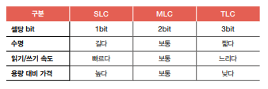

 

페이지(page) : 셀들이 모여 만들어진 단위

블록(block) : 페이지가 모여 만들어진 단위

블록이 모여 플레인(plane), 플레인이 모여 다이(die)가 된다.

플래시 메모리에서 읽기와 쓰기는 페이지 단위로 이루어진다.

삭제는 블록 단위로 이루어진다.

> 이렇게 읽기/쓰기 단위와 삭제 단위가 다른 것이 플래시 메모리의 가장 큰 특징 중 하나이다.

 

##### 페이지

페이지는 `Free`, `Valid`, `Invalid`의 세 가지 상태를 가질 수 있다.

- Free : 어떠한 데이터도 저장하고 있지 않아 새로운 데이터를 저장할 수 있는 상태

- Valid : 유효한 데이터를 저장하고 있는 상태

- Invalid : 유효하지 않은 데이터를 저장하고 있는 상태

플래시 메모리는 하드 디스크와 달리 덮어쓰기가 불가능해, Valid 상태인 페이지에는 새 데이터를 저장할 수 없다.

##### 동작

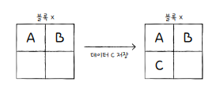

1. X라는 블록이 네 개의 페이지로 이루어지고, 두 개의 페이지에는 A, B라는 데이터가 저장되어 있다.

2. 새로운 데이터 C를 저장한다.(읽기/쓰기 단위는 페이지)

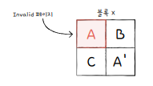

3. A를 수정하고 싶지만 덮어쓰기는 불가능

4. 따라서 저장된 A'는 Invalid 상태가 되고, 새로운 A 데이터가 저장된다. 따라서 블록 X의 Valid 페이지는 B, C, A'가 된다.

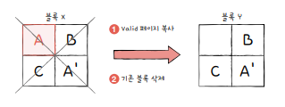

5. 이 때 쓰레기값인 A만 지울 수 없다.(삭제는 블록 단위로 수행되기 때문)

6. 따라서 유효한 페이지들만 새 블록으로 복사한 뒤, 기존의 블록을 삭제한다.(가비지 컬렉션)

 

## 7-2. RAID의 정의와 종류

### RAID의 정의

`RAID(Redundant Array of Independent Disks)`란 데이터의 안전성 혹은 높은 성능을 위해 여러 개의 물리적 보조기억장치를 마치 하나의 논리적 보조기억장치처럼 사용하는 기술

 

### RAID의 종류

RAID 구성 방법은 `RAID 레벨`이라 표현한다.

#### RAID 0

여러 개의 보조기억장치에 데이터를 단순히 나누어 저장하는 구성 방식

저장되는 데이터가 하드 디스크 개수만큼 나뉘어 저장된다.

- 스트라입(stripe) : 줄무늬처럼 분산되어 저장된 데이터
- 스트라이핑(striping) : 분산하여 저장하는 것

- 장점

  - 속도가 빠르다.
  - 4TB 저장 장치 하나를 읽고 쓰는 속도보다 RAID 0으로 구성된 1TB 저장 장치 4개의 속도가 이론상 4배정도 빠르다.

- 단점
  - 저장된 정보가 안전하지 않다.

이를 극복하기 위해 RAID 1이 등장했다.

#### RAID 1

RAID 1은 거울처럼 완전한 복사본을 만드는 방식인 `미러링(mirroring)`을 사용한다.

RAID 1에 어떠한 데이터를 쓸 떄는 원본과 복사본 두 군데에 쓰기 때문에 RAID 0보다 속도가 느리다.

- 장점

  - 문제가 발생했을 때 복구가 매우 간단하다.

- 단점
  - 하드 디스크 개수가 한정되었을 때 사용 가능한 용량이 적어진다.
  - 복사본이 만들어지는 용량만큼 사용자가 사용하지 못한다.
  - 따라서 비용이 증가한다.

#### RAID 4

RAID 4는 오류를 검출하고 복구하기 위한 정보인 `패리티 비트(parity bit)`를 저장한 장치를 두는 구성 방식이다.

패리티를 저장한 장치를 이용해 다른 장치들의 오류를 검출하고, 오류가 있다면 복구한다.

- 장점

  - RAID 1보다 적은 하드 디스크로도 데이터를 안전하게 보관할 수 있다.

- 단점
  - 새로운 데이터가 저장될 때마다 패리티를 저장하는 디스크에도 데이터를 쓰게 되므로 패리티를 저장하는 장치에 병목 현상이 발생한다.
  - 이를 해소하기 위해 RAID 5가 등장했다.

#### RAID 5

RAID 5는 패리티 정보를 분산하여 저장하는 방식으로 RAID 4의 문제인 병목 현상을 해소한다.

#### RAID 6

RAID 6의 구성은 기본적으로 RAID 5와 같지만, 서로 다른 두 개의 패리티를 둔다.

- 단점

  - 오류를 검출하고 복구할 수 있는 수단이 두 개이므로 더 안전한 구성이다.

- 장점
  - 새로운 정보를 저장할 때마다 함께 저장할 패리티가 두 개이므로, 쓰기 속도는 RAID 5보다 느리다.
  - 즉, RAID 6은 데이터 저장 속도를 조금 희생하더라도 데이터를 더욱 안전하게 보관하고 싶을 때 사용한다.
