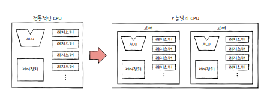
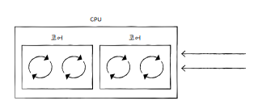
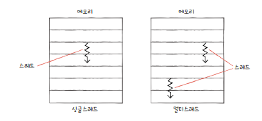
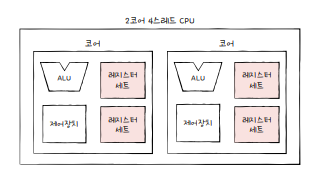

# 5. CPU 성능 향상 기법

## 5-1. 빠른 CPU를 위한 설계 기법

### 클럭

- 클럭 속도는 헤르츠(Hz) 단위로 측정한다.
- 1초에 100번 반복되면 = 100Hz
- 계속 일정한 클럭 속도를 유지하지 않고, 고성능이 필요한 순간에 클럭 속도를 높인다. 최대 클럭 속도를 강제로 더 끌어올리는 것을 `오버클럭킹`이라 한다.
- 클럭 속도가 너무 높아지면 발열 문제가 발생한다.

 

### 코어와 멀티코어

오늘날의 CPU는 '명령어를 실행하는 부품을 여러 개 포함하는 부품'을 의미한다.

- 8코어 = '명령어를 실행하는 부품'을 8개 포함한다.

 

이렇게 코어를 여러 개 포함하고 있는 CPU를 `멀티코어 CPU` 또는 `멀티코어 프로세서`라고 부른다.

하지만 CPU의 연산 속도가 코어 수에 비례하여 증가하지는 않고, 코어 수가 지나치게 많아도 영향이 없다.

 

### 스레드와 멀티스레드

스레드

- CPU에서 사용되는 `하드웨어적 스레드`
- 프로그램에서 사용되는 `소프트웨어적 스레드`

#### 하드웨어적 스레드

하나의 코어가 동시에 처리하는 명령어 단위  
하나의 코어로도 여러 개의 명령어를 동시에 실행할 수 있다.

하나의 코어로 여러 명령어를 동시에 처리하는 CPU를 `멀티스레드 프로세서` 또는 `멀티스레드 CPU`라고 한다.

- 하이퍼스레딩 : 인텔의 멀티스레드 기술

#### 소프트웨어적 스레드

하나의 프로그램에서 독립적으로 실행되는 단위  
하나의 프로그램이 실행되는 과정에서 프로그램의 여러 부분이 동시에 실행될 수도 있다.

#### 멀티스레드 프로세서

하나의 코어로 여러 명령어를 동시에 처리하려면 하나의 명령어를 처리하기 위해 꼭 필요한 `레지스터`를 여러 개 가지고 있으면 된다.

 

2코어 4스레드는 한 번에 네 개의 명령어를 처리할 수 있다. 
= 프로그램 입장에서는 한 번에 하나의 명령어를 처리하는 CPU가 네 개 있는 것처럼 보인다. 
= 하드웨어 스레드를 `논리 프로세서`라고 부르기도 한다.
